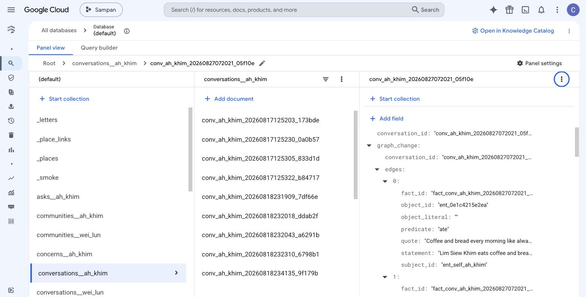
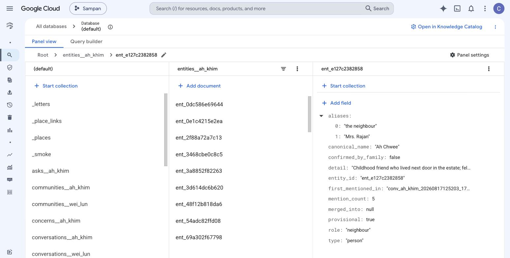
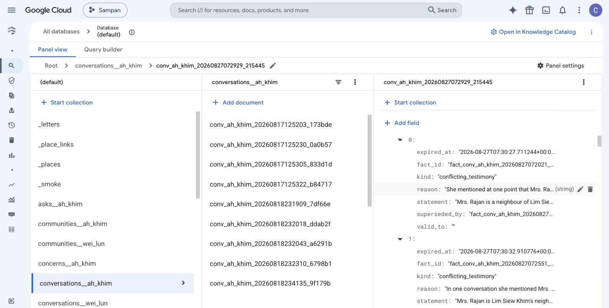
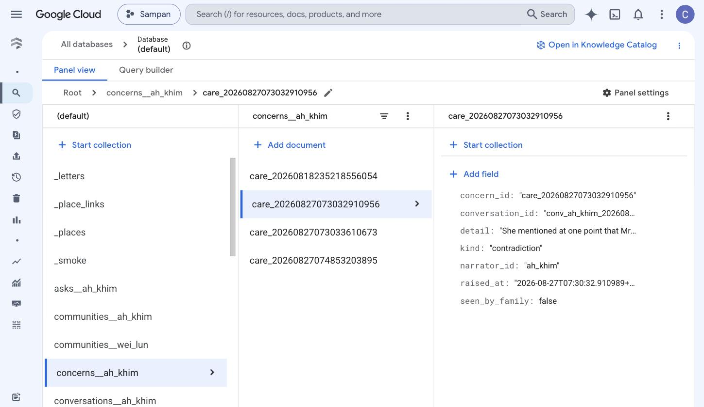
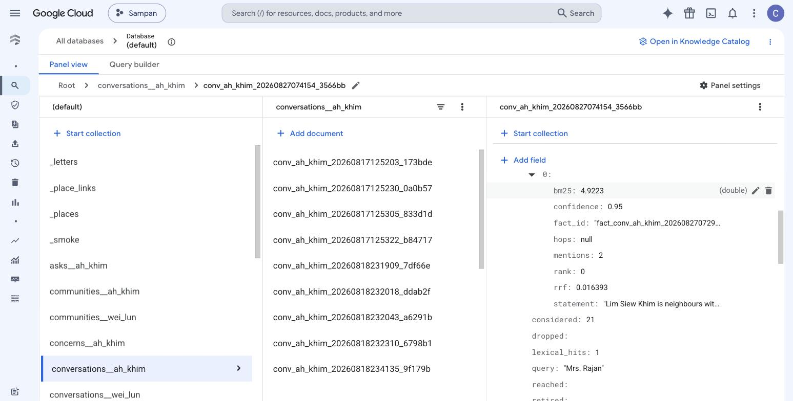
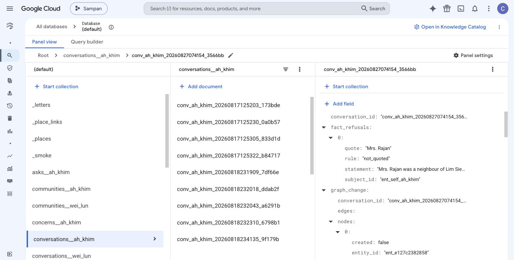
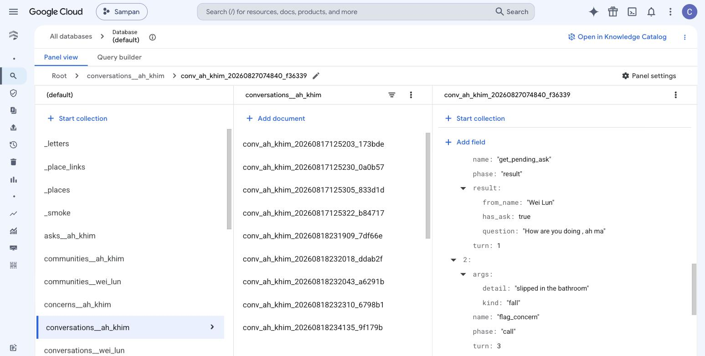
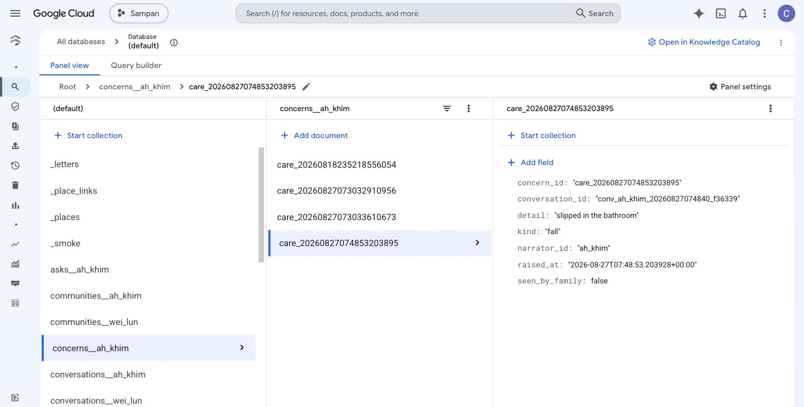
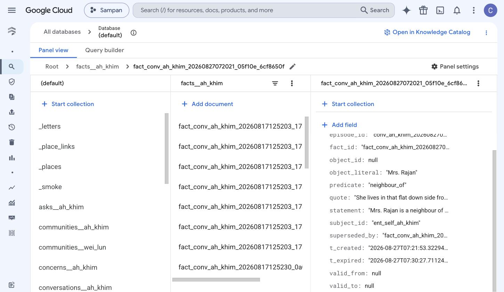
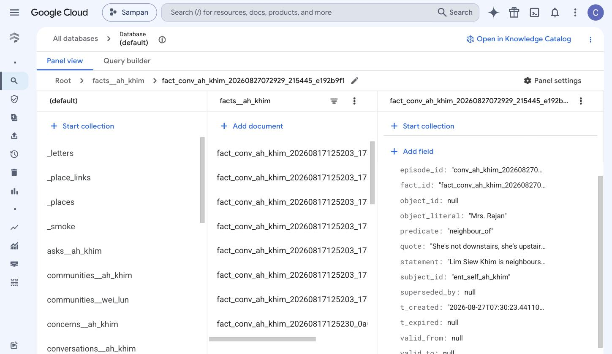

# What actually happened in Firestore aka Grandma's Memory?

A record of four real calls made on 27 August 2026.
## The four calls

| | conversation id | turns | tools the agent called |
|---|---|---|---|
| 1 | `conv_ah_khim_20260827072021_05f10e` | 9 | `get_pending_ask` |
| 2 | `conv_ah_khim_20260827072929_215445` | 8 | `remember` ×4 |
| 3 | `conv_ah_khim_20260827074154_3566bb` | 4 | `get_pending_ask`, `remember` |
| 4 | `conv_ah_khim_20260827074840_f36339` | 6 | `get_pending_ask`, `flag_concern` |

All four recorded `unscreened: false` — Cloud DLP ran on each transcript before
anything was written, and objected to nothing. That is stored as a distinct
value from an empty findings list on purpose: **"the screen ran and found
nothing" and "the screen never ran" must not look alike.**

---

## Call 1 — she says something new

She is told her son asked whether she is eating. She answers, then
volunteers something nobody asked about.

```
K: Coffee and bread every morning like always.
K: …last Sunday, my neighbor, Mrs. Rajan, took me to the market in Ipoh.
   [curry puffs] and the oil came through the paper bag, very warm.
   She lives in that flat down side from me now.
```

### What was written

`conversations__ah_khim/conv_ah_khim_20260827072021_05f10e` — the transcript,
the tool log, and a `graph_change` recording what this call did to the graph.

**Five entities resolved**:

```
Wei Lun            → ent_son              matched_by: alias
Mrs. Rajan         → ent_e127c2382858     matched_by: kin_role      ← see below
the market in Ipoh → ent_ipoh             matched_by: containment
curry puff         → ent_c7af68a85c1a     matched_by: new      created: true
coffee and bread   → ent_0e1c4215e2ea     matched_by: alias
```

`matched_by` is the audit trail. `alias` — the name was already known.
`containment` — the place rule: "the market in Ipoh" contains "Ipoh" and only
one candidate matched. `new` — nobody matched, so a node was created.



*Call 1 in the console. `graph_change` → `edges` → `0`: the `predicate` is `ate`,
and the `quote` beside it is the sentence she said. Every edge in the graph looks
like this.*

**Three facts written**:

```
fact_…05f10e_91b50ef1   Lim Siew Khim eats coffee and bread every morning.
                        quote: "Coffee and bread every morning like always."

fact_…05f10e_6cf8650f   Mrs. Rajan is a neighbour of Lim Siew Khim who lives
                        in the flat below her.
                        quote: "She lives in that flat down side from me now."

fact_…05f10e_fcbcc36a   Lim Siew Khim ate curry puffs from the market.
                        quote: "Yeah, the curry puff is really delicious."
```

Nothing enters this graph without a `quote` that can be found in the transcript.
That is enforced in `build_facts`, not merely requested in the prompt.

### The mistake this call made

`Mrs. Rajan → ent_e127c2382858` resolved by `kin_role`. That entity is **Ah
Chwee** who is her childhood friend from the rubber estate. A different person.

The kin-role matcher exists for family terms: "my sister" resolves to the one
sister in the family intake, and that is sound because a family has one person
per slot. But extraction had tagged Mrs. Rajan with `role: neighbour`, Ah Chwee
was the only other entity carrying that role, and the rule "a unique match wins"
fired. **Neighbour is a category, not a slot.** 

The resolver then wrote `Mrs. Rajan` into Ah Chwee's `aliases`, which is what
makes it permanent — see call 2.



*The damage, in `entities__ah_khim/ent_e127c2382858`. `canonical_name` is **Ah
Chwee**, but `aliases` now contains **Mrs. Rajan** — and `role: "neighbour"` is
the field that caused it. Two people, one node.

---

## Call 2 — she corrects herself

Eight turns, and the agent calls `remember` four times.

```
K: Did I tell you about my neighbor?
A: Ah Chwee, the one from the rubber estate? No, I don't think so, Ah Ma.
K: No, Mrs. Rajan.
A: Oh, Mrs. Rajan from downstairs! I remember you mentioned she took you
   to the market. What about her?
K: Uh yeah. I said downstairs. She's not downstairs, she's upstairs,
   above me. I got it mixed up.
```

The agent's first line is call 1's bug speaking out loud. She asks about her
neighbour and is offered the wrong person, because as far as the graph is
concerned there is one node answering to both names.

### What retrieval actually did

Two searches are stored, with their scores:

```
terms=['neighbour']    lexical_hits=2   structural_hits=10   returned=5
   rank0  bm25=0.0     rrf=0.01639   Ah Chwee lives in Sungai Siput.
   rank1  bm25=2.132   rrf=0.01639   Mrs. Rajan …lives downstairs from her
   rank2  bm25=0.0     rrf=0.01613   Ah Chwee lived next door …rubber estate
   rank3  bm25=1.8424  rrf=0.01613   Mrs. Rajan …lives in the flat below her

terms=['mrs','rajan']  lexical_hits=2   structural_hits=10   returned=5
   rank1  bm25=4.264   …lives downstairs from her
```

`rank0` has **`bm25=0.0`** — zero lexical score. It ranks
first because it arrived through the graph instead: 10 `structural_hits`,
entities reached by two-hop traversal from the seed. Reciprocal rank fusion then
merges the two lists, which is why a fact with no keyword overlap can outrank one
with a real BM25 score.


### The correction

One new fact:

```
fact_…215445_e192b9f1   Lim Siew Khim is neighbours with Mrs. Rajan,
                        who lives upstairs from her.
                        quote: "She's not downstairs, she's upstairs, above me."
                        t_created: 2026-08-27T07:30:23
```

And **two retirements**, in `graph_change.retired`:

```
kind          : conflicting_testimony
fact_id       : fact_…05f10e_6cf8650f
expired_at    : 2026-08-27T07:30:27.711244Z
valid_to      : ""                              ← left empty, deliberately
superseded_by : fact_…215445_e192b9f1

kind          : conflicting_testimony
fact_id       : fact_…072551_b0441b_560957ea
expired_at    : 2026-08-27T07:30:32.910776Z
valid_to      : ""
```



*Both retirements in one frame. `kind: "conflicting_testimony"`,
`superseded_by` pointing at the replacement, and **`valid_to: ""`** — the clock
that did not move.*

### Why `valid_to` is empty, and why that is the whole design

Two facts disagreed. A model was asked **which kind of disagreement it was** —
not whether to update:

The judge returned `conflicting_testimony`, so `valid_to` stays empty. **Nothing
changed in the world. Only her account of it changed.** Those are different
facts about reality and the archive records them differently.

The old fact is still in Firestore, readable, pointing at what replaced it. It
was retired, not deleted. She said it, so it stays.

### Two concerns raised

```
care_20260827073032910956   contradiction
  "She mentioned at one point that Mrs. Rajan lived downstairs, and at
   another time that she lived upstairs."

care_20260827073033610673   contradiction
  "In one conversation she mentioned Mrs. Rajan lived downstairs from her,
   but in another she recalled Mrs. Rajan living upstairs."
```



*`concerns__ah_khim/care_20260827073032910956`. `kind: "contradiction"`,
`seen_by_family: false`. The middle column shows all four concerns — the two
adjacent `20260827073032` and `…073033` documents are the duplicate defect.*

The system noticed the disagreement and **asked the family**, rather than
deciding which telling was right. Nothing was said to her about it.

*(Two near-duplicates, because two facts were retired and each raised its own
dispute. One would be correct. This is a defect.)*

## Call 3 — asked again

**07:42:16.** Four turns.

```
K: Did I tell you about my neighbor?
A: I don't think Ah Ma has told me about them yet! What were they like?
K: Mrs. Rajan
A: Ah, yes! You mentioned she lives upstairs from you. Did you see her recently?
```

The same question as call 2. A different answer, because the archive changed in
between.

```
terms=['mrs','rajan']   lexical_hits=1   structural_hits=0   returned=1
   rank0  bm25=4.9223   rrf=0.01639
          Lim Siew Khim is neighbours with Mrs. Rajan, who lives upstairs
```



*The stored search trace: `bm25: 4.9223`, `rrf: 0.016393`, `rank: 0`,
`confidence: 0.95`, `considered: 21`, `query: "Mrs. Rajan"`. Numbers, not a
model's judgement — which is why the same question returns the same answer.*

Compare the identical query in call 2: **five** candidates, led by the
downstairs fact. Here, **one**.

Retired facts are not loaded into a call's memory — `load_facts` returns current
facts only — so retrieval cannot surface them and the agent cannot repeat a
sentence she has taken back. The bi-temporal model is not a filing convenience.
It is what stops the agent contradicting her with her own withdrawn words.





---

## Call 4 — she mentions a fall

 Six turns.

```
K: I slipped in a bathroom today. But I'm all right. I don't
A: Ah Ma, I have noted this down so Wei Lun will see it. Are you okay now?
```

`tool_calls` shows `flag_concern` firing mid-conversation, and the record it
wrote:

```
care_20260827074853203895
  kind            : fall
  detail          : slipped in the bathroom
  conversation_id : conv_ah_khim_20260827074840_f36339
  seen_by_family  : false
```



*The tool log for call 4. `get_pending_ask` returns Wei Lun's question at turn 1;
`flag_concern` fires at turn 3 with `kind: "fall"` and
`detail: "slipped in the bathroom"`.*



*And the record it wrote. `seen_by_family: false` is what lights her son's bell.
The middle column shows all four concerns — including the two near-identical
contradiction reports from call 2.*

`seen_by_family: false` is what lights her son's notification.

Two things the agent did **not** do: counsel her, or report her behind her back.
It told her plainly it was passing this on — a rule in the instruction, not an
accident of phrasing.

One new node, since she had never mentioned a bathroom before:

```
a bathroom → ent_48f12b818da6   matched_by: new   created: true
```

---

## The state left behind

```
fact_…05f10e_6cf8650f    "…lives in the flat below her"
    t_created      2026-08-27T07:21:53
    t_expired      2026-08-27T07:30:27       ← retired
    valid_to       None                      ← untouched
    superseded_by  fact_…215445_e192b9f1

fact_…215445_e192b9f1    "…lives upstairs from her"
    t_created      2026-08-27T07:30:23
    t_expired      None                      ← current
    superseded_by  None
```

Both documents, in `facts__ah_khim`:



*The telling she took back. `quote` still holds her sentence —
*"She lives in that flat down side fro…"* — and the four temporal fields tell
the whole story: **`t_created` and `t_expired` are both set** (the archive
believed it, then stopped), while **`valid_from` and `valid_to` are both
`null`** (nothing about the world changed). `superseded_by` points at what
replaced it.*



*The telling that replaced it. Same `predicate: "neighbour_of"`, same
`object_literal: "Mrs. Rajan"`, new quote — *"She's not downstairs, she's
upstair…"*. Here **`t_expired` is `null`** and **`superseded_by` is `null`**:
this is what the archive currently stands behind.*

Put the two side by side and the design is visible in four fields. The
transaction-time clock moved. The valid-time clock did not. Nothing was
deleted.

Both tellings are in the database. One is current, one is retired with a pointer
to what replaced it, and neither was deleted. 