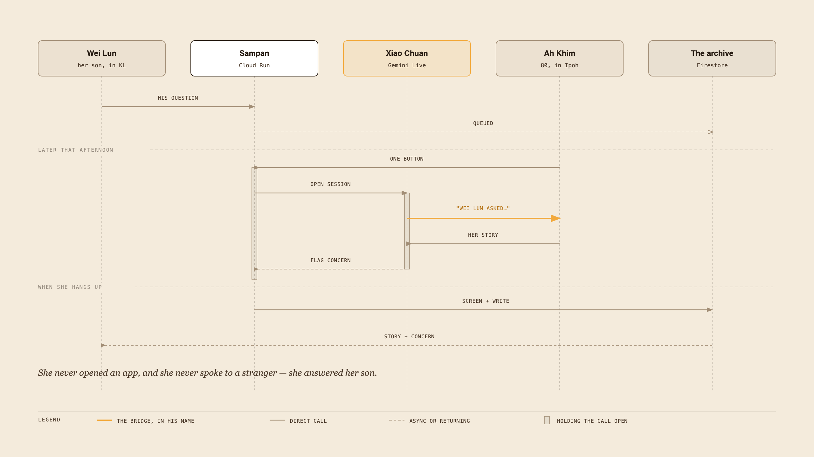
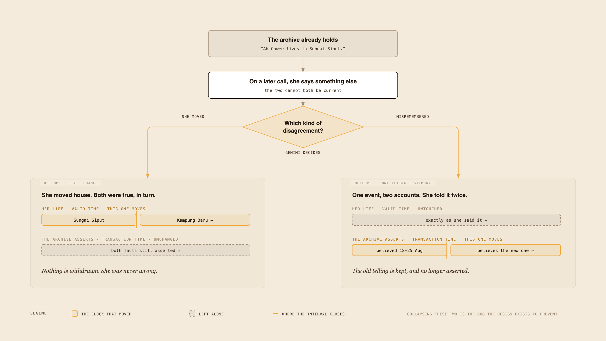
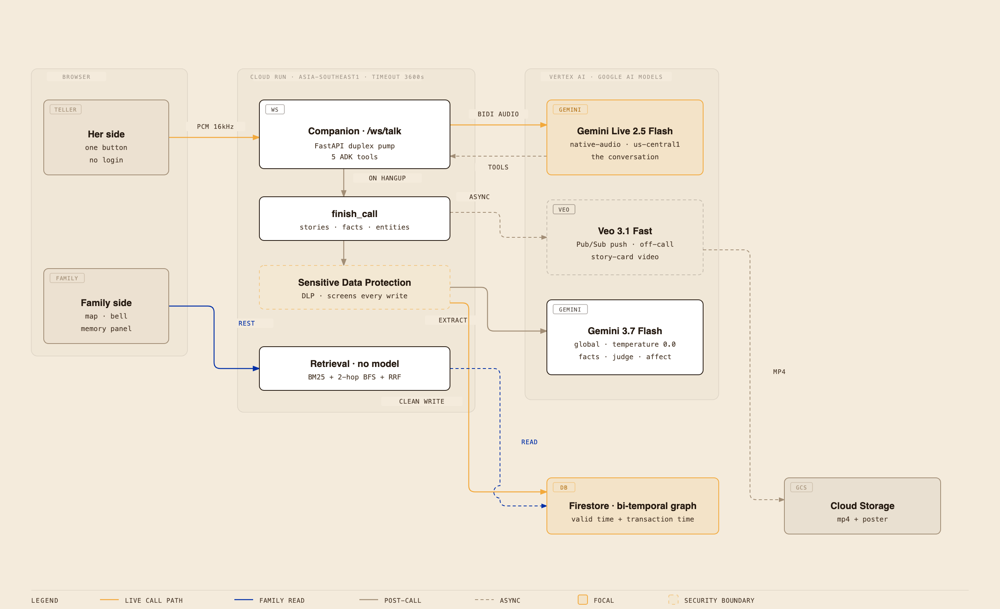

# Sampan — project submission

*A voice companion that phones an elderly parent, remembers what she says across
months, and hands it to her family as something they can walk through.*

**Live:** `https://sampan-ig6xl5kf4q-as.a.run.app` ·
**Track:** Collaborative Partner ·
**Diagrams:** `architecture.png` · `round-trip.png` · `two-clocks.png`

---

## If you read nothing else

An eighty-year-old woman presses **one button** on a phone and talks. On the
other end is a voice agent that already knows her — and that opens by asking her
**her son's actual question, in his name**.

Everything she says is turned into a map her family can walk through. If she
says something worrying, her son is told. If she later says something different,
the system works out whether **she changed** or **she misremembered** — because
those are not the same thing, and treating them the same is how you quietly
overwrite an old woman's memory.

It is a bridge to her family. It is deliberately not a friend.

---

## 1. Description

My grandmother is eighty. She lives in Ipoh; her son is in Kuala Lumpur, her
granddaughter is at university. They call on Sundays and ask whether she has
eaten.

She knows things nobody else knows. Which year the coffee shop opened. What her
mother put in the fried rice. Who lived in the next line-house on the rubber
estate. None of it is written down, and the family finds out what they lost
after she is gone.

There are apps that will record an elderly person's memoir. They ask her to
operate a phone, and they give the family a transcript. That is a filing
cabinet, and the filing cabinet is not the problem. **The problem is that she is
lonely and the family is busy, and nothing turns one into the other.**

Sampan phones her. She talks to Xiao Chuan — no app, no screen, no password. It
listens, remembers across months, and turns what she says into a map her family
can walk through. It carries their questions to her *in their name*, and carries
her stories back.

The design thesis, and the thing every decision below is measured against:
**the agent is a bridge to her family, not a substitute for them.** The failure
mode for a product like this is becoming the company she has instead of her son.

### Why the thesis is not a slogan

It came out of the literature, not out of a pitch deck. Jo et al.'s CareCall
deployment (CHI 2023, ~330 citations) is the closest published system to this
one — an LLM phone companion for socially isolated elderly people, at national
scale. What it reports is: reduced loneliness, real offload on care workers,
**and users who over-attach, who expect a memory the system does not have, and
who disclose more than they intended.** Lazar et al.'s systematic review of
reminiscence technology (2014, ~315 citations) reaches the same shape from a
different direction: the technology works best as a *conversation catalyst*, and
worst as a replacement for the person.

So Sampan is built to be visibly a bridge. Three concrete consequences:

- Xiao Chuan opens a call with a family member's actual question, attributed by
  name — never its own curiosity dressed up as theirs.
- When she says something that worries it, it does not counsel her. It tells her
  son.
- Every story is addressed outward: the map, the chapters and the letters exist
  for the family to read, not for her to re-read alone.

### The whole product in one picture

**Reading it left to right:** Wei Lun leaves a question from Kuala Lumpur. It is
queued instantly. That afternoon his mother presses one button in Ipoh; the
service opens a live voice session with Gemini, and the **orange arrow** is the
moment the whole product exists for — the agent saying *"Wei Lun asked…"* and
then his question, in his name. She tells a story. Her tone triggers a concern
flag, which goes to her son and never to her. When she hangs up, the transcript
is screened and written, and both the story and the concern arrive in his bell.

Nine messages. She never opened an app, and she never spoke to a stranger — she
answered her son.

---

## 2. Features and functionality

### Her side — one button

She presses **Tell a story**. A live, bidirectional voice conversation opens.
There is no login, no account, no menu. The session carries:

| | |
|---|---|
| **A question from her family** | If Wei Lun left one, the agent opens with it, by name. This is the bridge working inbound. |
| **Five tools the agent can call** | `get_pending_ask`, `remember`, `mark_private`, `forget_this`, `flag_concern` |
| **An affect monitor** | Runs on the audio in parallel; never intervenes in the conversation |
| **Quiet hours** | A question sent at 11pm is queued instantly and *delivered* in the morning |
| **Open-thread reopening** | "Last time the neighbour came to the door and you said you'd tell me the rest another day" |

### Her side — the things that protect her

- **`mark_private`** — a topic she does not want in the archive. Captured
  silently; never announced back at her.
- **`forget_this`** — a subject she wants removed. Recorded, and honoured on
  retrieval.
- **Preference capture** — that she is hard of hearing, that her sister is a
  sore subject. Learned from behaviour, never recited to her. An agent that
  announces what it has learned about you is unsettling rather than attentive.
- **Cloud DLP** screens every transcript *before* anything is written.

### The family side

| Feature | What it does |
|---|---|
| **The map** | Sixteen stories placed where they happened, 1946 → now. Pins distinguish *named in the telling* from *the system guessed*. |
| **Story cards** | Her words, kept as she said them, with a Veo-generated card image |
| **Chapters** | Entity communities, labelled — "the coffee shop years" |
| **Letters** | A short written piece per story, generated once and kept |
| **Ask her something** | Leave a question, optionally ten seconds of your own voice. It reaches her in your name. |
| **The bell** | New stories, answered questions, and **concern flags** |
| **Corrections** | The family may fix a name, a place, or merge two people |
| **Inside the memory** | The retrieval panel: retrieve, create, update — with the working shown |

### The rule that shapes the whole product

**The family may correct the system. Nobody corrects her.**

A wrong place, a duplicated person, a misheard name — those are the system's
errors and the family fixes them. But when *she* says something that contradicts
what the archive holds, the archive does not tell her she is wrong. It works out
which of two clocks moved, and moves that one. She is right in 1952 and right
again now.

### The two clocks — the idea the whole archive rests on

**In plain language.** Every fact the system stores carries *two* separate
timelines, and it is worth being slow about this because everything else follows
from it:

1. **Her life** — when a thing was actually true. She lived in Sungai Siput from
   1952. That is a fact about the world.
2. **What the archive believes** — when the system started asserting it, and if
   ever, when it stopped. That is a fact about the *system*, not about her.

Now she says something that does not match. There are exactly two reasons that
can happen, and they need opposite responses:

- **She moved.** Both statements were true, one after the other. The *first*
  timeline closes — Sungai Siput until 2026, Kampung Baru after. Nothing is
  withdrawn, because nothing was ever wrong.
- **She misremembered.** One event, two accounts. The *second* timeline closes —
  the archive stops asserting the older telling and keeps it. **Her own dates are
  not touched**, because the disagreement is about the account, not about her
  life.

Collapse those two into a single "update" and you get a system that records an
eighty-year-old as having been wrong every time she moved house. That is the
error the design exists to prevent — and §6 records the day I shipped it anyway.

### Inside the memory — the explainability panel

Three operations on the knowledge graph, each showing its working:

- **Retrieve** — type a question and watch the four stages: grounding (which
  terms survived, which entities the question named), exploration (what those
  reached within two hops), focus (BM25, hops, RRF for every candidate,
  including the rejected ones), and what the archive has stopped asserting.
- **Create** — write a sentence; it becomes an edge on whichever node it names
  and then competes for rank like any other. No special treatment for being new.
- **Update** — pick the telling she is correcting, say what she says now. Gemini
  decides which kind of disagreement it is, and *that decides which clock moves*.

Nothing in the panel is written to her archive — the sandbox rides on the
request and dies with it. That is not squeamishness about demo data. It is the
correction rule above, enforced in code.

---

## 3. Technologies used

**Reading it left to right:** the browser is only a microphone and a map. Every
decision happens in the middle column, on Cloud Run. The right column is the
three Google AI models, each placed opposite the thing that calls it. The bottom
row is storage. The orange path is a live call; the blue path is the family
reading; the dashed paths happen after she has hung up and nobody is waiting.

The dashed orange box is the one security boundary that matters: **nothing
reaches the database without passing through DLP first.**

### Google AI models — three, each doing one job

| Model | Where | Job |
|---|---|---|
| `gemini-live-2.5-flash-native-audio` | us-central1 | The conversation. Duplex native audio over a WebSocket. |
| `gemini-3.7-flash` | global, temperature 0.0 | Story extraction, fact extraction, contradiction judge, affect monitor, place resolver, letter writer, community labelling |
| `veo-3.1-fast-generate-001` | Vertex AI | Story-card video, off the call path via Pub/Sub |

**Not used, and not claimed:** Gemma and Lyria. Neither is integrated, so
neither appears in the architecture diagram.

### Google Cloud

- **Cloud Run** (`sampan`, asia-southeast1) — one FastAPI service. Request
  timeout raised to 3600s because the 300s default kills a call mid-story.
- **Firestore** (asia-southeast1) — the archive. Collections per narrator:
  `facts__`, `entities__`, `stories__`, `conversations__`, `asks__`,
  `concerns__`, `communities__`, `memories__`, `private__`, `forgotten__`.
- **Vertex AI** — all model calls, via `google-genai`.
- **Sensitive Data Protection (DLP)** — screening before every write. Two
  templates: `CREDIT_CARD_NUMBER` plus a custom `BANK_ACCOUNT_NUMBER` regex,
  and a de-identify template that replaces both.
- **Model Armor** — provisioned and wired, but **not the running backend.** It
  detects nothing itself: with only its SDP filter enabled it forwards to the
  same two DLP templates, so it costs a hop and a failure mode for no added
  detection (R18). Opt-in via `SAMPAN_SCREEN_BACKEND=armor`, which also brings
  its prompt-injection filter.
- **Pub/Sub** — the Veo generation queue, push-subscribed to
  `/internal/memories`.
- **Cloud Storage** — mp4 and poster for story cards.
- **Google ADK 2.7.0** — agent runtime, tool dispatch, session management.

### Application

Python 3.12 · FastAPI · Pydantic · uv · pytest · ruff · pyright ·
React 19 · TypeScript · Vite · Leaflet

**Scale:** 34 modules, ~8,900 lines of source, ~7,400 lines of tests,
**559 tests** (496 unit, 63 integration), 25 recorded architectural decisions.

### Where there is deliberately no model

Retrieval is **BM25 + two-hop breadth-first search + reciprocal rank fusion**,
with node-distance and episode-mention rerankers. No LLM anywhere in the read
path. The same question returns the same numbers every time — which is the only
reason it is honest to show the numbers at all.

---

## 4. Other data sources used

**Academic literature — the primary non-code input.** A Google Scholar–style
index was searched across **19 targeted queries**, returning **482 rows** now
kept in `research/scholar_csv/`, synthesised into a 213-line review at
`research/conversational-memory-literature-review.md` across nine areas.
Citation counts are as returned by that index on 2026-08-16 and are flagged
where they looked anomalous. Section 5 is the map from that review into this
codebase.

**OpenStreetMap** via CARTO tiles — the basemap the story pins sit on.

**Seed conversations — invented, and labelled as such.** Six transcripts
(four hers, two her son's) plus an intake fixture, all traceable to
`docs/persona-bible.md`. That document opens by stating the family is invented:
structurally true to the Chinese-Malaysian migration pattern — Fujian → rural
Perak → the city — but **no real person is depicted**. This matters twice: it is
the honest answer to "whose data is this", and it is the only defensible way to
build a system about an elderly person's private memories before that person has
consented to anything.

---

## 5. Research → implementation

This is the section the rest of the project hangs from. Every design below has
a citation behind it and a module in front of it.

### Six words you need for the rest of this section

| Word | What it means, plainly |
|---|---|
| **Knowledge graph** | Facts stored as *dots and lines* rather than paragraphs. "Ah Chwee" is a dot, "Sungai Siput" is a dot, and "lived at" is the line between them. It lets you ask *who* and *where*, not just search for words. |
| **Entity** | One of those dots — a person, a place, an object. The hard part is knowing that "my father", "Ah Hock" and "the man who ran the shop" are all the *same* dot. |
| **Valid time** | When something was true **in her life**. |
| **Transaction time** | When the **system believed** it. The two are different, and keeping them apart is the core of the design. |
| **BM25** | A decades-old, non-AI way of scoring how well a document matches a search term. Predictable, cheap, and it does the same thing every time. |
| **Bi-temporal** | Simply: carrying both of those clocks at once. |

### 5.1 Bi-temporal memory — Zep / Graphiti

> *The picture for this section is `two-clocks.png`, above.*

**Research.** Rasmussen et al., *"Zep: A Temporal Knowledge Graph Architecture
for Agent Memory"* (arXiv 2501.13956, ~360 cit). Entities and edges carry
**two independent time axes**: valid time (when a fact was true in the world)
and transaction time (when the system believed it). New facts *invalidate* old
edges rather than overwriting them, so history survives.

The review's verdict was blunt: this is *"the best-fit published model for
self-contradicting dialogue over months"* — which is precisely what an
eighty-year-old telling her life story over many calls produces.

**Implementation.** `facts.py` carries all four fields (`valid_from`,
`valid_to`, `t_created`, `t_expired`) and cites §2.2.3 in its module docstring.
`contradiction.py` implements Zep's candidate rule as written — same subject,
same predicate — in `candidates()`, and its two amendment operations in
`apply_state_change()` and `apply_conflicting_testimony()`.

**Where we depart.** Zep stores valid time as a timestamp. Elders do not speak in
timestamps. Ours is a `When`: her phrase (`"before I married"`), a resolved
year range when one can be derived, a precision (`exact / year / decade / era /
relative`), an optional anchor reference, and a confidence. Storing only her
phrase makes a timeline unsortable; storing only a guessed year loses how she
actually said it. We keep both.

### 5.2 Update semantics — Mem0, and where we go further

**Research.** Chhikara et al., *Mem0* (arXiv 2025, ~830 cit) — the deployed
reference: an LLM extracts candidate facts and applies **ADD / UPDATE / DELETE /
NOOP** against retrieved memories. The review's criticism is exact: *"conflict
resolution is 'LLM decides', not principled."* Unsolved-problem #4 says the same
thing at more length — *"I hated gardening" (2024) vs "I love my garden" (2026)*
— changed preference or different context? — *"delegated to LLM judgment
everywhere; no principled representation is evaluated."*

**Implementation, and our contribution.** We keep the LLM in the loop but give
it a *narrower and more consequential* question. It is not asked "update or
not". It is asked **which kind of disagreement this is**, and the answer selects
which clock moves:

| Verdict | What it means | What moves | Result |
|---|---|---|---|
| `state_change` | She moved house. Both were true, in sequence. | `valid_to` closes | Nothing is withdrawn; both facts stay current |
| `conflicting_testimony` | One event, two accounts. | `t_expired` + `superseded_by` | Old telling retired, **her valid time untouched** |
| `none` | They do not actually disagree | nothing | Both kept |

The prompt is biased toward `none`: *"an archive that quietly retires something
she said is worse than one holding two compatible statements."*

This is the difference between an overwrite and a representation. Collapsing the
two clocks is the exact error the bi-temporal design exists to prevent — and I
shipped that error and had to fix it, which is in §6.

### 5.3 Retrieval — Zep §3, BM25, RRF

**Research.** Zep's retrieval is several searches for recall, then a reranker
for precision. Reciprocal Rank Fusion (Cormack et al.) supplies the damping
constant `k=60` used verbatim.

**Implementation.** `retrieval.py` runs BM25 (`k1=1.5`, `b=0.75`) over fact
text, breadth-first search to two hops from entities the question names, and RRF
to fuse them. *Plainly:* one method finds facts whose **words** match the
question, a second finds facts **near** the people the question named, and the
third merges the two rankings without either one being able to dominate. Two of Zep's rerankers are deliberately *not* implemented, and the
docstring says why: MMR, because *"diversity matters at five hundred results and
not at five"*; and the cross-encoder, because it puts a model back into a path
whose entire value is that it has none. Zep's third search — cosine over embeddings —
is left as a slot rather than an omission.

**One departure with a reason.** Terms under three characters are dropped. In an
archive full of *Ah Chwee*, *Ah Fatt* and *Ah Gong*, keeping `ah` means a
question about Ah Seng returns Ah Chwee, confidently and wrongly.

### 5.4 Communities — Zep §2.3

**Research.** Zep uses **label propagation rather than Leiden**, for
"straightforward dynamic extension".

**Implementation.** `communities.py` implements both: `detect()` for full
propagation to convergence, and a single recursive step for incremental
updates — the paper is explicit that the dynamic case is one step, not a rerun.
These become the family-facing "chapters".

### 5.5 Retrieval explainability — TrustGraph

**Research.** TrustGraph exposes what a query retrieved from the graph, modelled
on W3C PROV-O provenance: question → grounding → exploration → focus →
synthesis.

**Implementation.** `Inside the memory` reproduces that shape against our own
retrieval, with one advantage we can claim and they cannot: **our read path has
no model in it**, so the numbers are reproducible. TrustGraph spends an LLM call
on entity grounding; we do a substring sweep over a few dozen entities, which is
cheaper *and* deterministic.

The panel shows the rejected candidates as well as the returned ones. Those are
the more useful half — they show what the ranking weighed, not just what it
picked.

### 5.6 Extraction faithfulness — the critical literature

**Research.** This is the literature I took most seriously, because it is about
how the system fails rather than how it works.

- Huang et al., *npj Digital Medicine* 2024 (~334 cit) and Shah, *JAMA Network
  Open* 2024 (~100 cit): fabricated and run-inconsistent field values when
  schema-filling from unstructured text.
- Niimi, *"Distortion Instead of Hallucination"* (2026): under strict output
  constraints, models **distort content to satisfy the schema** rather than
  omitting what they do not know.
- Jiang et al., NAACL 2024 (~90 cit): hallucination tracks **entity
  frequency** — rare, ambiguous entities are worst-case. An elderly person's
  acquaintances are exactly that.

**Implementation.** Extraction is allowed to **refuse**. `fact_extraction.py`
has a `Refusal` type with the rule that declined each proposed edge; a fact
without a supporting quote is rejected rather than filled in. `build_facts`
refuses subjects it cannot resolve to a known entity. The extractor runs at
`temperature=0.0` — which was not the original setting, and §6 explains what
that cost.

### 5.7 Entity resolution — false merges cost more than false splits

**Research.** Welch et al. (CIKM 2012): in *incremental* settings, **false
merges propagate and contaminate everything attached to the merged node**.
Menestrina et al. (VLDB 2010, ~120 cit): pairwise precision/recall
mischaracterises merge/split error structure. The review flags honestly that the
asymmetry has never been *quantified* for personal conversational graphs.

**Implementation.** Resolution is conservative and records how it decided —
`matched_by` is one of alias, kin role, containment, tiebreaker, or new. When
two entities look like the same person, the system does **not** merge them. It
surfaces them to the *family* as a correction candidate. False splits are
visible and cheap to fix; false merges are invisible and poison the graph.

### 5.8 Event-anchored personal time

**Research.** Unsolved-problem #2: *"no working system normalizes such
expressions against a personal event timeline, and no agent-memory system stores
intervals-with-uncertainty."* TimeML/THYME support event anchoring on paper;
EventTempEx (AACL-IJCNLP 2025) is the one new tool and has zero citations.

**Implementation.** `anchors.py`. Once her marriage is known to be 1968, every
*"before I married"* acquires an upper bound. Both representations are kept —
her phrase and the derived range — with a precision and a confidence. Retroactive
re-resolution of facts recorded *before* an anchor was known is deferred and
labelled as deferred.

### 5.9 Unfinished threads — no literature at all

**Research.** Unsolved-problem #6: *"No system or benchmark represents open loops
('she never said how the dispute ended') — an obvious companion feature with no
literature."* The Area-1 verdict says the same: *"Nothing published handles
'unfinished conversational threads' as a first-class memory type — that is an
open design space."*

**Implementation.** `threads.py`, and its docstring states the design directly:
*"The single most valuable memory feature and among the cheapest."* The
distinction the module exists to preserve is **why** a thread was left open — a
doorbell means she was mid-story and wants to return; tiredness means the story
is done for today, and reopening it reads as nagging. Same open loop, opposite
correct behaviour.

### 5.10 Forgetting, consent, and the HCI evidence

**Research.**

- Jo et al., CHI 2024 (~123 cit): visible long-term memory **increases
  self-disclosure** — and some users are disturbed by "memory surprises",
  because they have forgotten what they told the agent.
- Unsolved-problem #8: *"No evaluated design lets a user inspect, correct, or
  delete what a companion remembers."*
- Hollanek & Nowaczyk-Basińska (2024, ~230 cit): the griefbot harms framework —
  consent, dignity, grief interference.
- Xiong et al., ACL 2026 (~94 cit): agents **over-trust stale memories**.

**Implementation.** `mark_private` and `forget_this` are tools the agent can
call *during the conversation*, so she never has to find a settings screen. The
family view exposes what the system holds, and the correction path is
first-class rather than an admin screen. Retired facts are kept and visibly
marked rather than deleted — which is also the answer to over-trusting stale
memory: the archive knows what it has stopped asserting, and says so.

**Where we depart from MemoryBank.** Zhong et al. (AAAI 2024, ~1,250 cit)
imports the Ebbinghaus forgetting curve as a decay policy. We do not implement
decay, and the review is why: disagreement #2 records that *"decay policies that
help benchmarks may harm the relationship"*, because elderly users **expect and
reward indefinite memory**. Forgetting here is something she asks for, not
something a curve does to her.

### 5.11 Affect, and the line we will not cross

**Research.** CareCall's reported harms: over-attachment, expectation gaps,
unintended disclosure. de Wynter (ACL 2025): *engagement does not equal
welfare*.

**Implementation.** `affect.py` monitors the audio alongside the conversation.
It does not counsel her, does not tell her she seems sad, and does not decide
anything. It raises a **concern flag to her son**. A product that made an
eighty-year-old feel less lonely while her family learned nothing would be a
failure that looked like a success.

---

## 6. Findings and learnings

### The bug that proved the thesis

I hardcoded the correction path to `conflicting_testimony`. Then I tested it with
the demo's own example — *"Ah Chwee lives in Kampung Baru now"* — and the real
judge returned **`state_change`, confidence 0.95**: *"Ah Chwee appears to have
moved from Sungai Siput to Kampung Baru."*

She moved. Both tellings were true, in sequence. Retiring the old one asserts she
misremembered — and **collapsing the two clocks is the precise error the entire
bi-temporal design exists to prevent.** I had shipped that error inside the panel
built to explain the difference.

Two things came out of it. The obvious one: the judge is now in the loop, and two
sentences produce two different clocks live in front of an audience. The less
obvious one: **the graph could not draw the difference.** It knew *asserted* and
*withdrawn*, and a state change is neither — the archive still stands behind the
fact; her life moved on. So a correction changed nothing visible and looked
broken. Three states became four.

### Things that exist in code and never run

Twice, working code was never executed, and nothing failed.

- `finish_call` takes `fact_extractor` and `judge` as *optional* keywords. The
  WebSocket handler passed neither. **The entire memory-v2 pass — fact
  extraction, contradiction, every edge the graph is made of — was skipped on
  every real call for as long as it had existed.** Nothing raised. The graph only
  ever grew when a backfill script was run by hand. Fixed by making production
  build all three together or not at all.
- An integration test for the contradiction path raised `ValidationError` in its
  own setup, before any model call. It had been committed without ever being
  seen to pass.

The lesson is narrower than "write tests": **optionality at a seam is right for
testing and wrong for production**, and a test you have not watched fail is not
evidence.

### A hypothesis I was confident about and was wrong

Corrections were being lost. I concluded the extractor rejected denial-led
phrasing — *"no, it wasn't 1969"* — and had a tidy explanation ready.

Then I measured it. Denial-led corrections were proposed **8 times out of 8**;
kept 3 of 4. Assertion-only kept 4 of 4. The phrasing hypothesis was wrong. The
real cause was **non-determinism at `temperature=0.1`**, now 0.0.

This is Shah (JAMA Netw Open 2024) landing on my own code — quantified
run-to-run inconsistency in LLM extraction — and I would have "fixed" the wrong
thing with a plausible story if I had not measured.

### The security control that reported success while doing nothing

Model Armor's SDP filter **delegates** to Cloud DLP. When its service agent
lacked `roles/dlp.user`, the API returned **HTTP 200** with
`EXECUTION_SKIPPED` — and my first parser read that as a clean transcript. The
screen was reporting success while screening nothing.

Two fixes. `EXECUTION_SKIPPED` and `invocation_result: FAILURE` are now detected
and the call is flagged `unscreened` — which is *not* the same as an empty
findings list. One means the screen ran and objected to nothing; the other means
it never ran. Which calls went through unchecked has to be a query, not a guess.

Separately: `FINANCIAL_ACCOUNT_NUMBER` detects nothing on Malaysian bank
formats, despite the name. I swept every DLP info type at three likelihood
levels to confirm it, and there are no `MALAYSIA_*` types at all. The template
(`scripts/setup_armor.sh`) now pairs `CREDIT_CARD_NUMBER` — which works, being
Luhn-checkable — with a custom `BANK_ACCOUNT_NUMBER` regex, measured at **one
finding and no false positives across her whole archive**.

### Where the literature disagreed and we had to pick

The review's own "where the literature disagrees with itself" section forced
three choices:

1. **Structured memory vs. raw transcripts.** ConvoMem shows that under ~150
   conversations, full-history retrieval matches complex memory systems. We
   built structured memory anyway — because the disagreement decomposes by
   question type, and *temporal reasoning, knowledge updates and abstention* are
   exactly where structured wins. Those three are the whole product.
2. **Is forgetting good?** Benchmarks reward decay; elderly users reward
   permanence. We sided with the users (§5.10).
3. **Episodic richness vs. semantic compression.** Pink et al. argue compression
   destroys what episodic memory keeps. We store both — her exact words as the
   quote behind every fact, so the graph is an *index into* the transcript
   rather than a replacement for it.

### What I would tell someone starting this

- **Deletion is the highest-quality move**, in schematics and in scope. The
  memory panel got better every time something came out of it.
- **Pick the honest version of the demo.** Which fact is being corrected is
  chosen by *clicking*, not inferred, because on a real call a model does that
  and the demo does not run it. Saying so out loud is cheaper than being caught.
- **Instrument the thing you are about to explain.** Every number the retrieval
  panel shows was already being computed and thrown away on the return line. The
  panel cost almost nothing to build and changed how much of the system I could
  defend.

### Honest limits

- The Gemini contradiction judge was wired into `finish_call` only recently, and
  **her archive still contains zero retired facts.** That path has never
  produced a supersession on real call data — only through the sandbox.
- Retroactive anchor re-resolution is deferred.
- Embedding search is a slot, not an implementation.
- One narrator, one family, six seeded sessions. Everything here is a
  demonstration that the design holds, not evidence that it holds at scale — and
  unsolved-problem #7 in the review is precisely that nobody has measured whether
  what a companion remembers about a real elderly person **stays true over
  months**. We have not measured it either.

---

## 7. What is genuinely new here

Of the eight problems the literature review lists as unsolved, this project puts
a working implementation against four:

| # | Open problem | What Sampan does |
|---|---|---|
| 2 | Event-anchored personal time | `anchors.py` — her phrase *and* a derived range, with precision and confidence |
| 4 | Contradiction semantics | The verdict selects the clock; two clocks, never collapsed |
| 6 | Unfinished threads as memory | `threads.py` — open loops, with *why* they were left open |
| 8 | Forgetting / consent mechanics | In-conversation `mark_private` and `forget_this`; corrections as a first-class family path |

None of these is evaluated at research standard, and I am not claiming they are.
What I am claiming is that they are **built, running, and honest about their
limits** — which is more than the review found anywhere for problems 6 and 8.
