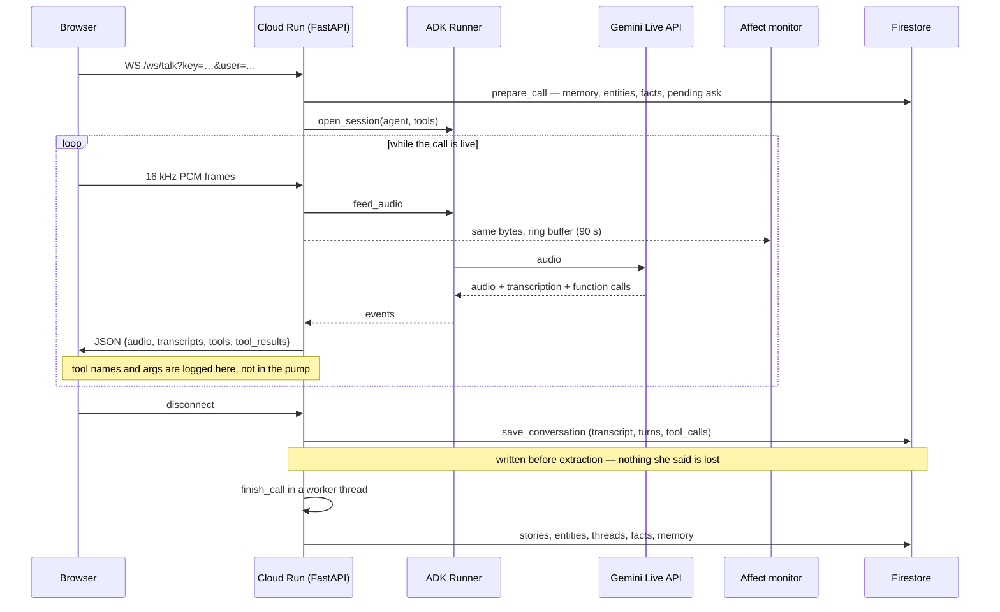

# Sampan — System Analysis (backend)

Scope: the Python service under `src/sampan/`, its storage, and its model calls. The React
front end is out of scope except where it constrains the backend (§12).

This is a design record, not a README. `README.md` says how to run it; this says why it is
shaped this way and what that shape cost.

---

## 1 · Revision history

| Rev | Date | Change | Supersedes |
|---|---|---|---|
| 1 | 2026-08-20 | First issue. Covers the service as of `d1652a19`, after the memory v2 revamp, the front-end redesign, and the ask-queue and tool-log fixes. Auditing the collection inventory for §7.3 found R11, a write-only `forgotten` collection. | — |

Verification basis for this revision: names, routes, collections and constants were read from
source at `d1652a19`; collection document counts were read from the live Firestore database
`(default)` in project `ringed-empire-505702-u0` on 2026-08-20. No latency or throughput
figures are measured — see §9.4 and R7.

---

## 2 · Overview and design pillars

Sampan telephones an elderly woman, listens to her life stories, remembers them across months,
and turns them into an archive her family can walk through.

The backend is one FastAPI service. It does four things:

1. **Holds a voice call** — browser microphone to Cloud Run to the Gemini Live API and native
   audio back, with tools the agent can call mid-sentence (§8.1).
2. **Extracts afterwards** — the Archivist turns a finished transcript into scored stories, an
   entity graph, open threads and preferences (§8.2).
3. **Remembers bi-temporally** — facts are edges with two clocks, so a story told differently
   later retires the earlier telling without deleting it (§8.3).
4. **Serves the family** — map, chapters, questions, corrections, and a bell (§8.5).

Four pillars constrain every decision below.

**The agent is a bridge, not a substitute.** Every question it puts to her carries the name of
the family member who asked. The agent takes no credit. This is why `Ask.from_name` is
non-optional in the model rather than a nullable convenience field (§7.3).

**Her words are the artefact.** Extraction may summarise, rank and connect, but the verbatim
sentence is what the product protects. Facts carry the quote that justifies them and are
refused without it (§8.3, D7). Her control over that record is only half built: `mark_private`
is honoured end to end, `forget_this` is recorded and never read (R11).

**Uncertainty is drawn, never asserted.** A place the system guessed is stored and rendered
differently from a place she named. A year nobody said is not written down (D9).

**Fail closed, not quiet.** A misconfigured deployment must refuse to serve rather than accept
stories into a dictionary and report success (§8.6, D2).

---

## 3 · Terminology

| Term | Meaning |
|---|---|
| **Narrator** | Someone whose stories are in the archive. Identified by `narrator_id` (`ah_khim`, `wei_lun`, `xin_yi`). |
| **Viewer** | Whoever is holding the phone. Same identifier space as narrator; decides whose bell and whose waiting question. |
| **Companion** | The live voice agent, "Xiao Chuan". `companion.py`. |
| **Archivist** | Post-call extraction. `archivist.py`. Runs after hang-up, never during. |
| **Episode** | One conversation. Stored whole in `conversations__<narrator_id>`. |
| **Fact** | An edge in the memory graph: subject, predicate, object, plus the sentence she said. `facts.py`. |
| **Valid time (T)** | When something was true in her life. `valid_from` / `valid_to`. |
| **Transaction time (T′)** | When the archive believed it. `t_created` / `t_expired`. |
| **Retired** | A fact whose `t_expired` is set. Still readable; no longer asserted. |
| **Chapter** | A community detected in the fact graph, named by a model. `communities.py`. |
| **Ask** | A question a family member left for a narrator. |
| **Thread** | An unfinished subject the next call can reopen. `threads.py`. |
| **Anchor** | A dated life event used to resolve her relative time expressions ("the year after we moved"). `anchors.py`. |
| **Seam** | A pure function chosen as a test boundary. Four exist (§9.1). |

---

## 4 · Requirement background

Built as a solo entry to the All Things Agentic hackathon (Gemini + Google Cloud,
Collaborative Partner track). Two audiences with opposite needs share one archive: an
80-year-old in Ipoh talking for ten minutes at a time, and her family browsing for three
minutes at night. `PRD.md` holds the product requirements; `docs/persona-bible.md` holds the
character constraints on the agent's speech.

Two requirements shape the backend more than the rest:

- **The call must feel like a call.** No turn-taking UI, no push-to-talk, barge-in supported.
  That forces the Live API and therefore ADK (D3).
- **Memory must survive months.** Session 20 has to differ from session 1 in production, not
  only in a test. That forces durable storage of derived state, not just transcripts (D5).

---

## 5 · Objectives and targets

| # | Objective | Target | Status |
|---|---|---|---|
| O1 | A call runs end to end without holding the socket open for extraction | Extraction starts after hang-up | Met (§8.2) |
| O2 | Nothing she said is lost, even if extraction fails | Transcript written before extraction | Met (§8.2, D6) |
| O3 | The agent never asserts a fact she did not say | Facts refused without a verbatim quote found in the transcript | Met (§8.3, D7) |
| O4 | A misconfigured deploy refuses rather than degrades silently | Startup/dependency failure on missing project or key | Met (§8.6, D2) |
| O5 | Retrieval is deterministic and testable without a network | Seam 4 is a pure function | Met (§8.4, D10) |
| O6 | A call is affordable enough to demo repeatedly | No measured budget | **Not measured** — R7 |
| O7 | Call latency feels conversational | No measured budget | **Not measured** — R7 |

O6 and O7 are stated because they matter, not because they were verified. Neither has a number
in this document, and neither should be quoted as if it does.

---

## 6 · Requirement analysis

### 6.1 Scope

In scope: the FastAPI service, Firestore persistence, the ADK live loop, the Archivist, the
memory graph, and the family read models.

Out of scope for this document: the React front end (`web/`), the demo notebook
(`notebooks/`), and the seed conversations (`docs/seed-sessions.md`).

### 6.2 Dependencies

| Dependency | Version pin | Used for | Failure behaviour |
|---|---|---|---|
| `google-adk` | `>=2.7.0` | Live session, tool dispatch, session service | Call cannot start |
| `google-genai` | `>=2.18.1` | Archivist, affect, places, letters, communities | Per-feature degradation (§8.7) |
| `google-cloud-firestore` | `>=2.28.1` | All persistence | Fail closed (D2) |
| `fastapi` / `uvicorn[standard]` | `>=0.141.1` / `>=0.52.3` | HTTP + WebSocket | — |
| `pydantic` / `pydantic-settings` | `>=2.13.4` / `>=2.15.0` | Every model and all config | — |
| `tzdata` | `>=2026.3` | Quiet hours in `Asia/Kuala_Lumpur` | Quiet hours cannot be computed |

Python `>=3.12`. Container is `python:3.12-slim`, dependencies installed with `uv sync
--locked`. `uv` itself is pinned to `0.12.5` by digest-free tag in the Dockerfile — a mutable
tag would let an upstream resolver change alter two builds of the same commit.

---

## 7 · System analysis

### 7.1 Architecture

Annotations that matter:

- **The affect fork is two lines in `feed_audio`.** ADK never touches the microphone — the
  application pushes PCM into a queue — so a copy costs nothing and needs no ADK hook. There
  is no plugin callback for live audio and none is needed.
- **Extraction is in-process, after the socket closes.** The call is over for her the moment
  she hangs up.
- **The affect state reaches the agent only through tool responses.** A live session cannot be
  re-instructed mid-call, so `policy()` output rides back on the next tool result (§8.1).

### 7.2 Module map

| Module | Lines | Responsibility |
|---|---|---|
| `app.py` | 771 | FastAPI app, all routes, the WebSocket handler, read-model caches |
| `models.py` | 670 | Domain model for extracted stories |
| `repository.py` | 405 | All persistence; one collection per narrator |
| `affect.py` | 419 | Audio→state assessment and the behaviour policy |
| `archivist.py` | 364 | Transcript → stories, entities, threads, anchors, preferences |
| `places.py` | 329 | Geocoding and relational place linking |
| `opener.py` | 324 | How a call starts: session plan and topic lean |
| `communities.py` | 315 | Chapter detection and naming |
| `live.py` | 312 | ADK session, event encoding, tool log, audio ring buffer |
| `tools.py` | 258 | The five tools the Companion can call |
| `retrieval.py` | 236 | Seam 4 — ranking facts for a query |
| `callflow.py` | 234 | `prepare_call` / `finish_call` |
| `contradiction.py` | 215 | Routing a disagreement to the right time axis |
| `notifications.py` | 210 | The bell |
| `fact_extraction.py` | 207 | Transcript → facts, with refusals |
| `facts.py` | 160 | The `Fact` edge and its two clocks |
| others | — | `entities`, `family`, `household`, `letters`, `preferences`, `threads`, `anchors`, `ask_about`, `corrections`, `quiet`, `auth`, `config`, `store` |

### 7.3 Data model

Firestore, database `(default)`, region `asia-southeast1`. Collections are **flat with `__`
scoping**, not subcollections (D4).

Sixteen collections exist. The list below is complete in both directions: every collection
constant declared in source appears here, and every collection present in the live database on
2026-08-20 appears here. Counts are live document counts; `a` / `w` distinguish `ah_khim` from
`wei_lun` where a collection is per-narrator.

#### Household and identity

| Collection | Doc id | Docs | Written by | Read by | Purpose |
|---|---|---|---|---|---|
| `members` | `narrator_id` | 3 | Seed / `save_member` | `list_members` | The household roster. Its **own** collection rather than inferred from who has stories, so a granddaughter who has never recorded still appears — she is a member of the family, not a row in a dataset |
| `profiles` | `narrator_id` | 2 | `save_memory`, end of every call | `load_memory`, start of every call | `NarratorMemory`: threads, anchors, preferences, sensitivities, session count, last closure. **Read whole and written whole.** Small by construction; everything that grows without bound lives elsewhere |

#### The archive proper

| Collection | Doc id | Docs | Written by | Read by | Purpose |
|---|---|---|---|---|---|
| `conversations__<id>` | `conv_<narrator>_<ts>_<rand>` | 13a / 2w | `save_conversation`, immediately on hang-up | `search_transcripts`, `call_log`, place linking | The transcript as spoken, plus `turns` and `tool_calls`. Written **before** extraction and before the length check, so a crash loses derived state and never her words (D6). Also the substrate for `search_transcripts`, because structured records lose sequence, context and affect |
| `stories__<id>` | `<conversation_id>_<NN>` | 11a / 5w | `save_stories` | `cards_for`, every family view | Scored stories from extraction. Id embeds the conversation, so a story always points back at the call it came from |
| `entities__<id>` | `entity_id` | 33a / 12w | `save_entities` | `prepare_call`, chapters, retrieval seeds | People, places and things, resolved and merged across calls |
| `facts__<id>` | `fact_id` | 18a / 4w | `save_facts`, `expire_fact` | `load_facts`, `search_facts`, chapters | The graph edges, current **and** retired. `load_facts` filters to current by default; `current_only=False` reads the history of a belief |
| `communities__<id>` | `community_id` | 3a / 1w | `save_communities` — replaced wholesale | `load_communities` | Chapters. Replaced rather than merged, because a refresh recomputes every label and merging would leave chapters the current graph no longer supports |

#### The bridge to the family

| Collection | Doc id | Docs | Written by | Read by | Purpose |
|---|---|---|---|---|---|
| `asks__<id>` | `ask_id` | 7 | `queue_ask` | `pending_asks` (bell), `pending_ask` (call) | Questions the family left. Carries `delivered`, `delivered_at` and `chosen` **beside** the `Ask` model, not on it — bookkeeping is not part of the domain object, and `_to_ask` strips all three on read |
| `concerns__<id>` | `care_<microsecond ts>` | 3 | `raise_concern`, from the `flag_concern` tool | `open_concerns` → bell, family view | Care flags. Routed to the family and **never** back to the person they are about |
| `seen` | `viewer_id` | 2 | `mark_seen` | `_seen_ids` | One document per viewer holding a sorted id list. The only thing about notifications written down at all — everything else in the bell is derived on read |

#### Her control over the record

These two look alike and are not. Both are per-narrator, both hold a subject string, and they
do opposite things.

| Collection | Doc id | Docs | Written by | Read by | Purpose |
|---|---|---|---|---|---|
| `private__<id>` | `priv_<hash>` | 1 | `mark_private`, from the `mark_private` tool | `private_subjects` → `build_cards`, `household` | She asked for something to stay off the family's view. The story is **kept** and hidden from readers. The agent says "I won't write that down"; that sentence has to survive the call, so it is stored rather than held in call memory |
| `forgotten__<id>` | `forget_<hash>` | 1 | `forget`, from the `forget_this` tool | **Nothing — see R11** | She asked for something to be dropped. A tombstone rather than a delete, so the request itself survives and a later extraction pass cannot rebuild what she asked to lose. **The read side was never built**, so the tombstone currently prevents nothing |

#### Caches and probes

Prefixed `_`, all derived, all safe to delete — the system rebuilds them on next read.

| Collection | Doc id | Docs | Written by | Purpose |
|---|---|---|---|---|
| `_places` | `raw_name` | 13 | `_resolve_places` | Geocoding results. Cached because a place does not move, and the map is the view a family opens most often — re-resolving per load would be the single largest avoidable cost |
| `_place_links` | `narrator_id` | 2 | `_link_relational_places` | Joins "my father's shop" to a place she named in another session. One document per narrator holding the whole link set |
| `_letters` | `story_id` | 15 | `_letters_for` | Generated letters. Written once and kept, because a letter about 1958 will not change |
| `_smoke` | `uuid4` | 2 | `POST /debug/smoke` | Write-then-read probe proving the Firestore round trip. Exists so a green health check cannot be mistaken for working persistence |

**Scoping is `f"{collection}__{narrator_id}"`** (`Repository._scoped`). Everything below
`Repository` is scoped to one person because that is how memory works — the agent remembers
*her*. `household.py` is the deliberate exception and aggregates across narrators, because the
map is the one place a family sees itself as a family.

### 7.4 Extension points

| Seam | Interface | Implementations |
|---|---|---|
| Story extraction | `StoryExtractor` | `GeminiStoryExtractor`, fakes in tests |
| Fact extraction | `FactExtractor` | `GeminiFactExtractor`, fakes |
| Contradiction | `ContradictionJudge` | `GeminiContradictionJudge`, fakes |
| Chapter naming | `CommunityNamer` | `GeminiCommunityNamer`, fakes |
| Affect | `AffectMonitor` | `GeminiAffectMonitor`, fakes |
| Storage | `DocumentStore` | `FirestoreDocumentStore`, `InMemoryDocumentStore` |
| Semantic ranking | `semantic` callable on `search_facts` | **None supplied.** The φ_cos slot is open (§8.4) |

---

## 8 · Detailed design

### 8.1 The voice loop (`live.py`, `app.py`, `tools.py`)

**Shape.** Browser → `/ws/talk` → ADK `Runner` → Live API. The browser sends binary PCM and
receives JSON. Auth rides on a query parameter because browsers cannot set headers on a
WebSocket handshake — this is the one route not protected by the `require_api_key` dependency,
and it checks `settings.api_key` inline instead (§11).

**Contract.** 16-bit PCM, 16 kHz mono in; 24 kHz out. `INPUT_MIME =
"audio/pcm;rate=16000"`.

**Tools.** Five, down from nine (D8):

| Tool | Purpose |
|---|---|
| `get_pending_ask` | Whether family left a question. Used once at the start |
| `remember` | Look up a person, place or thing she mentioned |
| `mark_private` | She said something the family should not see |
| `forget_this` | She asked for something to be dropped |
| `flag_concern` | A fall, chest pain, or that life is not worth living |

Every tool response carries a guidance channel back to the model — `_guidance`,
`_turn_length`, `_not_yet_spoken_of`. This is the **only** way affect state reaches the agent:
a live session cannot be re-instructed mid-call, so the policy output rides on the next tool
result. It reaches the screen immediately, which is what a demo shows, but the agent learns of
it one tool call later. That asymmetry is a real limitation, not an implementation detail
(R3).

**Rules encoded in the design.**

| Rule | Failure it prevents |
|---|---|
| `pump` never leaves `run_live` early | ADK's generator raises `RuntimeError: generator didn't stop after athrow()` on `break`, `return` or cancel — and a browser disconnect does exactly that on every call. The queue is closed instead and the generator finishes on its own |
| The affect ring buffer is bounded at 90 s (`AFFECT_WINDOW_SECONDS`) | An elderly user may talk for fifteen minutes; none of it needs to be held beyond the analysis window |
| `Ask.from_name` is non-optional | The attribution is the emotional payload of the product. A nullable field invites dropping it |

**Tool log.** Both halves of every tool call are recorded — `{turn, phase, name, args}` on the
reach and `{turn, phase, name, result}` on the answer — and written with the conversation.
Captured in `relay`, not in `pump`, so the log holds exactly what the browser was told and
there is one thing to keep correct instead of two. Results are summarised: the guidance
channel rides back on every response and is not part of what was looked up. A response whose
keys are unrecognised records its shape (`{"keys": [...]}`) rather than `{}`, because an empty
object reads as *the tool returned nothing*, which is a different and more alarming claim.

### 8.2 The Archivist (`archivist.py`, `callflow.py`)

Runs in a worker thread once the socket closes, via `asyncio.to_thread`, wrapped in
`contextlib.suppress(Exception)`.

**Order is load-bearing.** `save_conversation` writes the transcript, turn count and tool log
*before* the `MIN_TURNS_TO_EXTRACT = 4` check and before extraction. So:

- a call too short to extract from still keeps its transcript and its tool record — the case
  you most want them for;
- a crash between hang-up and write loses that call's *extraction*, never her words, and the
  call can be re-extracted.

**A short call does not consume the pending question.** Below four turns is a misdial, a wrong
moment, or a phone put down. She may have heard his question read out and had no chance to
answer. Burning it would tell Wei Lun it had been delivered and leave her never asked again.

### 8.3 Facts and the two clocks (`facts.py`, `fact_extraction.py`, `contradiction.py`)

After Zep/Graphiti (arXiv 2501.13956). A `Fact` is an edge with a closed `Predicate` StrEnum
of thirteen values (`LIVED_AT`, `WORKED_AT`, `OWNED`, `MADE`, `ATE`, `MARRIED_TO`,
`PARENT_OF`, `SIBLING_OF`, `NEIGHBOUR_OF`, `ESTRANGED_FROM`, `BORN_AT`, `DIED`,
`TRAVELLED_TO`) and **two independent timelines**:

| Clock | Fields | Question it answers |
|---|---|---|
| Valid time (T) | `valid_from`, `valid_to` | When was this true in her life? |
| Transaction time (T′) | `t_created`, `t_expired`, `superseded_by` | When did the archive believe it? |

`is_current` is `t_expired is None` — transaction time only. A fact about 1958 that ended in
1969 is still *current*; a fact she later corrected is *retired*.

**Extraction refuses three ways** (`build_facts`): the quote is not present in the transcript,
the subject is unknown, or the fact asserts nothing. `ExtractedFact` is deliberately **not**
`Fact` — it omits `fact_id`, `t_created`, `t_expired` and `superseded_by`, because a schema is
part of the prompt and one carrying fields its instructions do not govern gets those fields
filled.

**Contradiction routes to the correct axis** — this is the decision the subsystem exists for:

| `Disagreement` | Meaning | Action |
|---|---|---|
| `NONE` | Compatible | Both kept |
| `STATE_CHANGE` | The world changed | `valid_to` set on the old fact. Valid time |
| `CONFLICTING_TESTIMONY` | She told it differently | `t_expired` + `superseded_by` set. Transaction time; **valid time untouched** |

The family may correct the system; they may never correct her. A grandchild who "knows" the
shop closed in 1970 does not get to overwrite 1969.

### 8.4 Retrieval (`retrieval.py`) — seam 4

Pure, deterministic, no network. Three rankings fused with Reciprocal Rank Fusion, then
reranked.

| Component | Implementation | Status |
|---|---|---|
| φ_bm25 | Okapi BM25, `_K1 = 1.5`, `_B = 0.75` | Present |
| φ_bfs | Breadth-first hops from seed entities, `depth = 2` | Present |
| φ_cos | `semantic` callable parameter | **Slot open, no implementation supplied.** Retrieval is lexical plus structural |
| Fusion | RRF, `_RRF_K = 60` | Present |
| Rerank | Node distance, then episode mentions | Present |

**`_MIN_QUERY_TERM = 3`** is the non-obvious constant and it fixes a real defect. In a corpus
of a few dozen sentences, IDF cannot discount a common token, so asking about "Ah Seng" —
someone the archive has never heard of — matched a fact about "Ah Chwee" on the honorific
alone, and the agent would have told her about the wrong person with complete confidence.
Query terms shorter than three characters are discarded; document tokens keep their full
length, because they still count toward length normalisation.

That φ_cos is absent is a deliberate deferral, not an oversight (D11), and it is the first
thing to add if recall proves inadequate at a larger corpus size.

### 8.5 The family side (`notifications.py`, `family.py`, `household.py`)

**The bell serves two audiences.** She gets *someone asked you*; her family get her new
stories and her care concerns. **Nobody is notified about their own recordings**, and care
concerns go to the family and never back to the person they are about. This is correct and it
has a consequence worth stating plainly: Ah Khim's bell can *never* contain "Ah Khim mentioned
hopelessness". Only her family's can. The family half of the product is unreachable without
switching viewer, which is why the front end has an explicit viewer control.

**The ask queue is FIFO for delivery and not for notification.** The call carries one question
and only one — two would turn a conversation into an inbox. The bell lists every undelivered
one. Conflating these meant a second question queued behind the first was invisible to
everybody: the sender saw nothing appear, and the person it was for had no idea anyone was
waiting.

`choose_ask` is the one thing that overrides FIFO. Opening a specific question from the bell
marks it chosen; `pending_ask` prefers a chosen question and falls back to the oldest;
`mark_ask_delivered` clears the flag so an answered question cannot hold the front. Without
it, tapping "Wei Lun asked you something" started a call in which the agent asked someone
else's question and said the wrong name aloud — the archive contradicting itself in her ear.

**Notification ordering** is two stable sorts, not one key: newest first, then grouped by
urgency and unseen state. The three fields do not sort in the same direction, and a single
ascending key was quietly putting the oldest item on top.

**Quiet hours** (`quiet.py`) are 22:00–08:00 `Asia/Kuala_Lumpur`. The window crosses midnight,
so `is_quiet` is a union, not a range. Delivery is instant rather than scheduled — her son's
pang of missing her arrives at 2pm, when she is awake — but a question left at 11pm must not
greet her at 11pm.

### 8.6 Configuration and fail-closed behaviour

| Env var | Default | Notes |
|---|---|---|
| `GOOGLE_CLOUD_PROJECT` | `""` | Empty ⇒ `configured` is false |
| `GOOGLE_CLOUD_LOCATION` | `asia-southeast1` | **Data** region |
| `SAMPAN_VERTEX_LOCATION` | `global` | **Model** region for text |
| `SAMPAN_LIVE_LOCATION` | `us-central1` | Live API region |
| `FIRESTORE_DATABASE` | `(default)` | |
| `SAMPAN_ARCHIVIST_MODEL` | `gemini-3.7-flash` | |
| `SAMPAN_AFFECT_MODEL` | `gemini-3.7-flash` | |
| `SAMPAN_LIVE_MODEL` | `gemini-live-2.5-flash-native-audio` | |
| `SAMPAN_TIMEZONE` | `Asia/Kuala_Lumpur` | |
| `SAMPAN_QUIET_FROM` / `_UNTIL` | `22` / `8` | Equal values disable the window |
| `SAMPAN_API_KEY` | `""` | Empty ⇒ every guarded route returns 503 |
| `SAMPAN_ALLOW_IN_MEMORY_STORE` | `false` | Opt-in only |

**Two fail-closed points, both deliberate:**

- `build_store` raises `RuntimeError` when no project is configured unless
  `SAMPAN_ALLOW_IN_MEMORY_STORE` is explicitly true. A deployed revision that lost its project
  id must fail loudly rather than accept stories into a dictionary and report success.
- `require_api_key` returns **503**, not 401, when `settings.api_key` is empty — a service
  with no secret configured is broken, not a request that is unauthorised.

`require_api_key` compares as **bytes**: Starlette decodes headers as latin-1 and
`secrets.compare_digest` raises `TypeError` on non-ASCII `str`, which would surface as a 500
with a traceback instead of a clean 401.

**The location split is the configuration decision most likely to be "simplified" by someone
later.** Models are served from `vertex_location`; story data stays in `location`. ADK
constructs its own `genai.Client` from the environment and never sees a settings object, so
`apply_genai_env` pushes `GOOGLE_CLOUD_LOCATION` to the **live** region — the Archivist builds
its own client and passes `vertex_location` explicitly. Collapsing these breaks one or the
other.

### 8.7 Degradation matrix

| Failure | Behaviour | Degraded result distinguishable? |
|---|---|---|
| No `GOOGLE_CLOUD_PROJECT` | `RuntimeError` at store construction | Yes — service does not serve |
| No `SAMPAN_API_KEY` | 503 with explanatory detail | Yes |
| Wrong API key | 401 | Yes |
| Firestore unavailable | Exception propagates; request fails | Yes |
| Geocoding fails | Place kept unresolved; story goes to the "no place at all" tray | Yes — the tray is a visible state |
| Place linking fails | Links empty; relational places stay unplaced | Yes — same tray |
| Letter generation fails | Story renders without a letter | **Partially** — an absent letter looks like a story that did not warrant one |
| Affect assessment fails | State unchanged; call continues | **No** — indistinguishable from a steady state. R4 |
| Extraction fails after hang-up | Transcript kept; no stories | Yes — the call appears with `turns > 0` and no stories |
| Live session drops | Socket closes; `finish_call` still runs | Yes |

Two rows deserve attention rather than acceptance. The affect row is a design bug by the
standard this document uses: a monitor that silently stops assessing is indistinguishable from
one reporting calm (R4). The letter row is milder but has the same shape (R5).

---

## 9 · Function analysis

### 9.1 The four seams

Testing is organised around four pure functions rather than around modules. Each takes data
and returns data, so the model can be replaced by a fake without a network.

| # | Seam | Signature shape |
|---|---|---|
| 1 | `ingest_conversation` | transcript + known state → stories, entities, threads, anchors, preferences |
| 2 | `build_session_plan` | threads + sensitivities + ask + history → plan |
| 3 | `apply_assessment` | current affect state + assessment → new state |
| 4 | `search_facts` | query + graph → ranked facts |

### 9.2 Test inventory

459 tests total: **399 unit** (default), **60 integration** (`-m integration`, deselected by
`addopts = "-q -m 'not integration'"`). Largest suites:

| File | Tests | File | Tests |
|---|---|---|---|
| `test_opener.py` | 38 | `test_tools.py` | 21 |
| `test_affect.py` | 34 | `test_facts.py` | 21 |
| `test_entity_resolution.py` | 30 | `test_communities.py` | 21 |
| `test_live.py` | 28 | `test_service.py` | 20 |
| `test_anchors.py` | 27 | `test_callflow.py` | 20 |
| `test_retrieval.py` | 22 | `test_quiet.py` | 17 |
| `test_preferences.py` | 22 | `test_threads.py` | 17 |

The 60 integration tests chain four sessions against the real model and are the only evidence
that memory accumulates across calls in production rather than in a fixture.

### 9.3 Boundary cases with tests

| Case | Covered by |
|---|---|
| A question queued behind another | `test_notifications.py` — the bell lists all; the call takes one |
| An answered question releasing the front of the queue | `test_notifications.py` |
| A call below four turns | `test_callflow.py` — transcript kept, ask not consumed |
| A quote not present in the transcript | `test_facts.py` — refused |
| Query terms shorter than three characters | `test_retrieval.py` |
| Quiet-hours window crossing midnight | `test_quiet.py` |
| A tool result carrying the guidance channel | `test_live.py` — stripped from the log |

### 9.4 Performance

**Not measured.** No latency, throughput or cost figure in this document is derived from a
measurement, and none should be quoted. Cloud Run is configured `--cpu=1 --memory=1Gi
--concurrency=20 --timeout=3600 --max-instances=3`.

`--timeout=3600` is part of the contract, not deployment detail: the 300 s default kills calls
mid-story and presents as a Live API bug.

---

## 10 · Decisions

| # | Decision | Rationale — why this and not the obvious alternative |
|---|---|---|
| D1 | One FastAPI service, not a service per concern | The alternative is a call path spanning three deployments for a system with one narrator and three readers. Splitting buys isolation nobody needs and costs a demo that must start reliably in front of judges |
| D2 | Missing project or key fails closed | The obvious alternative — fall back to an in-memory store — was rejected because a deployed revision that lost its project id would accept stories into a dictionary and report success. Silent data loss is worse than a refusal |
| D3 | ADK server-side, browser never talks to the Live API | The browser *can* hold a Live session directly, which removes a network hop. It also removes ADK entirely, taking tools, session management and the audio fork with it. The extra hop is the price of keeping them |
| D4 | Flat collections with `__` scoping, not Firestore subcollections | Subcollections are tidier and would give per-narrator queries for free. They also require an odd number of path elements, which a `dict`-backed `DocumentStore` cannot model. Flat keeps the whole pipeline runnable without a cloud project |
| D5 | Derived state persisted, not recomputed from transcripts | Recomputing on read is simpler and always consistent. It also means every family page load re-runs extraction over months of transcripts, and memory would exist only as a function of the model rather than as a durable artefact |
| D6 | Transcript written before extraction, and before the length check | Writing once at the end is one round trip instead of two. It also means a crash between hang-up and write loses her words rather than only the derived stories |
| D7 | Facts refused without a verbatim quote found in the transcript | Trusting the extractor yields more facts and better coverage. It also produced place links justified by model reasoning rather than by anything she said — two forged links reached the map before the check existed |
| D8 | Nine tools consolidated to five, behind one `remember` | Nine tools map cleanly onto nine capabilities. They also gave a live model nine chances to pick wrong mid-sentence, and the retrieval-shaped ones (`get_open_threads`, `recall`, `what_do_you_remember`) were one question asked three ways |
| D9 | A year nobody said is not written down | Storing a bracketed estimate makes the timeline complete and sortable. It also makes a machine's guess indistinguishable from her testimony in the one artefact the family will treat as hers |
| D10 | `search_facts` is pure, with the model behind an injected callable | Calling the model inside retrieval is fewer moving parts. It also makes ranking untestable without a network and non-deterministic across runs, in the one place where a wrong answer is spoken aloud with confidence |
| D11 | φ_cos deferred; retrieval is lexical plus structural | Embeddings are the standard third ranking and Zep uses them. At a few dozen facts per narrator, BM25 plus graph distance already saturates the useful signal, and an embedding index is infrastructure to keep correct for gain that cannot yet be observed. The slot is a parameter, so adding it is not a rewrite |
| D12 | Label propagation for communities, not Leiden | Leiden gives better modularity and is what the literature uses. It also needs a dependency and a resolution parameter to tune, on a graph of a few dozen nodes where the communities are visually obvious. Label propagation is thirty lines, deterministic with a min-label tiebreak, and supports Zep's dynamic `extend` step directly |
| D13 | Contradiction routed to two different time axes | One "corrected" flag is simpler. It also conflates *the world changed* with *she remembers it differently*, and the second must never be recorded in a way that implies she was wrong |
| D14 | The bell lists every waiting question; the call carries one | Reusing `pending_ask` for both is one code path. It also made every question behind the first invisible to everyone — the sender saw nothing change and the recipient was never told anyone was waiting |
| D15 | Tool calls logged from `relay`, not from `pump` | Logging inside the pump is closer to the source. It also creates two things to keep correct: what was sent and what was recorded. Capturing the encoded message means the log is exactly what the browser was told |
| D16 | Tool results summarised, unrecognised ones recorded by shape | Storing responses whole is lossless. It also stores the guidance channel on every entry and can store a dozen facts per `remember`. Recording `{}` for an unrecognised response was rejected separately: it reads as *the tool returned nothing*, a different and more alarming claim than *nothing was recognised* |
| D17 | Extraction in-process on a worker thread, not Pub/Sub | Pub/Sub is the right answer at any real volume and gives retries for free. It also adds a topic, a subscription, a second deployable and an at-least-once contract to a system with one narrator. Accepted cost: a crash between hang-up and write loses that call's extraction (R1) |

No decision has been superseded or withdrawn as of revision 1.

---

## 11 · API definition

All routes require the shared secret in the `X-Sampan-Key` header except where noted.

| Method | Path | Handler | Auth |
|---|---|---|---|
| GET | `/health` | `health` | **Open** — Cloud Run liveness probe. Not `/healthz`: Cloud Run's front end intercepts that path and answers with its own 404 before the request reaches the container |
| POST | `/debug/smoke` | `smoke` | Key |
| GET | `/api/household` | `household` | Key |
| GET | `/api/family/{narrator_id}` | `family_view` | Key. `?view=` selects `feed` (default), `map`, `timeline`, `chapters` |
| POST | `/api/family/{narrator_id}/about` | `ask_about_her` | Key |
| POST | `/api/family/{narrator_id}/ask` | `leave_ask` | Key |
| GET | `/api/family/{narrator_id}/corrections` | `pending_corrections` | Key |
| POST | `/api/family/{narrator_id}/corrections` | `correct` | Key |
| GET | `/api/bell/{viewer_id}` | `bell` | Key |
| POST | `/api/bell/{viewer_id}/seen` | `bell_seen` | Key |
| GET | `/api/talk/{narrator_id}/pending` | `pending_for_her` | Key |
| POST | `/api/talk/{narrator_id}/pending/choose` | `choose_pending` | Key |
| GET | `/api/talk/{narrator_id}/calls` | `call_log` | Key. `?limit=` clamped to 1–50 |
| WS | `/ws/talk` | `talk` | **Query parameter** `?key=` — browsers cannot set headers on a WebSocket handshake. Closes with code 4401 on failure |

`GET /health` reports `configured` and `backend` so a green smoke test cannot be mistaken for
a Firestore round trip.

---

## 12 · Dependent interfaces

The front end constrains the backend in three places, and each is a contract rather than a
convention:

| Contract | Consumer | Note |
|---|---|---|
| WebSocket message shape | `web/src/useRecorder.ts` | `{audio, sample_rate, user_transcript, agent_transcript, interrupted}`. `tools` / `tool_results` are emitted and **not** consumed — they exist for the Firestore log |
| `?user=` viewer identity | `web/src/api.ts` | No accounts. The parameter decides whose bell and whose waiting question |
| `?key=` in the query string | Everything | A link is enough to open the archive. Stated as a limitation, not an auth model (R6) |

---

## Appendix A · Excluded sections

No external template was imposed. Sections omitted from the default structure and why:

- **Requirement analysis use cases** — held in `PRD.md`, not duplicated here.
- **Data migration** — none. The archive has never had a schema change requiring one; the
  bi-temporal design was introduced by adding fields, and `scripts/backfill_facts.py` filled
  them.

## Appendix B · Open items

| # | Item | Needs a ruling from |
|---|---|---|
| B1 | Whether the elder-side UI should be Chinese-primary. The approved redesign specifies `Noto Serif SC` and Chinese copy on her screens; the archive and seeds are entirely English by an earlier explicit instruction. Implemented in English pending a decision | Product |
| B2 | Whether `remember` results should be logged with their recalled facts rather than field names only | Product / demo needs |
| B3 | Whether to keep committing built front-end assets to `static/` now that the Dockerfile builds them | Engineering |

## Appendix C · Accepted risks and limitations

| # | Risk | Consequence | Status |
|---|---|---|---|
| R1 | Extraction is in-process (D17) | A crash between hang-up and write loses that call's extraction. Transcript survives; the call can be re-extracted | Accepted |
| R2 | No retry or dead-letter on any model call | A transient Vertex failure silently costs one letter, one place resolution, or one affect tick | Accepted |
| R3 | Affect state reaches the agent only via the next tool response | If the agent calls no tool, it never learns she is tired. The screen updates; the behaviour does not | Accepted, and the least satisfying part of the design |
| R4 | A failed affect assessment is indistinguishable from a calm one | A monitor that stops working presents as a steady state. **Design bug, not a documentation gap** | Open — no fix designed |
| R5 | A story with no letter looks like a story that did not warrant one | Mild version of R4 | Accepted |
| R6 | API key rides in the query string | Anyone with the link has the archive. Adequate for a demo, not for real families | Accepted, stated in `PRD.md` |
| R7 | No latency, cost or throughput measured | O6 and O7 are unverified. Any performance claim about this system is currently unfounded | Open |
| R8 | φ_cos absent from retrieval (D11) | Recall depends on lexical overlap and graph proximity. A question phrased with no shared vocabulary will miss | Accepted at current corpus size |
| R9 | `remember` and `flag_concern` log field names, not values | The tool log proves *that* the agent looked something up, not *what came back* | Open — see B2 |
| R10 | Single Firestore database, no backup configured | Deleting the database loses the archive | Accepted for a hackathon; unacceptable for the product this pretends to be |
| R11 | `forgotten__<id>` is **write-only**. `Repository.forgotten()` has no callers anywhere in `src/`, `tests/` or `scripts/` | When she says "forget that", the tombstone is written and then consulted by nothing. Extraction is not filtered by it, so a later pass can rebuild exactly what she asked to lose — and the agent has already told her it would not. The stated rationale for the tombstone design is sound; the read side was never built | **Open — defect, not a limitation.** Found by auditing this document's collection list at rev 1 |
